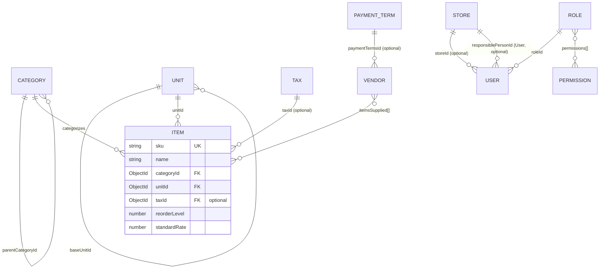
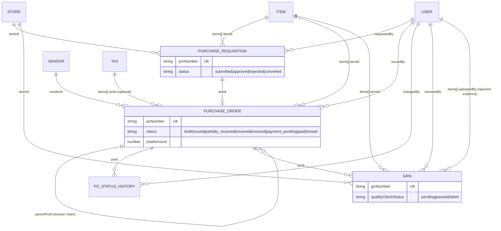
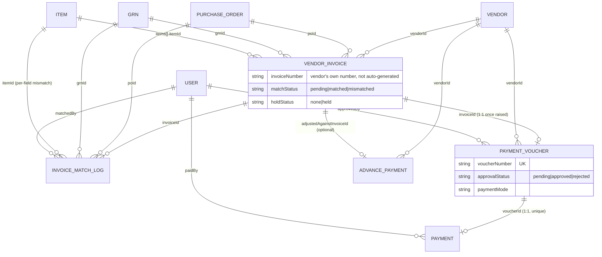
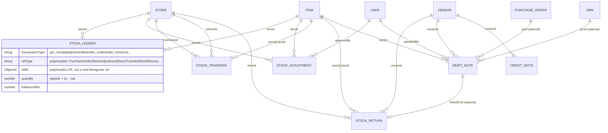
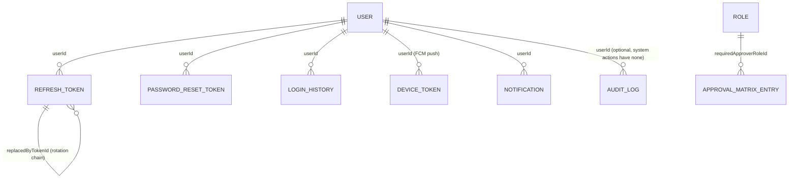

# FMB ERP — Entity Relationship Diagram

Generated from the actual Mongoose schemas in `backend/src/models/*.model.js`. Regenerate/update this
whenever a model's fields or `ref`s change — treat drift here as a bug, not a doc nit.

## Core masters

**No `Department` master.** The SOP's Section 4 ("Master data required") lists exactly three masters —
Item, Vendor, Store/location. An earlier pass added an optional `Department` master + `User.departmentId`
as generic org-chart convenience; it was removed since nothing in the actual workflow (approvals,
permissions, reports) ever read it, and it wasn't SOP-mandated. Don't re-add it without a concrete
requirement driving it — the SOP's "teams" (Store, Procurement head, Purchase, Finance & HR) are roles
in the workflow, not a master data table.

**`Vendor` fields are scoped exactly to the SOP's Section 4 row**: "Vendor name, contact, items
supplied, agreed rates, payment terms, bank details" → `name`, `contactPerson`/`phone`/`email`,
`itemsSupplied[]`, `VendorItemRate` (separate model), `paymentTermsId`, `VendorBankAccount` (separate
model). An earlier pass added `address`, `gstin`, `panNumber`, and a `status`
(active/inactive/blacklisted) enum — none SOP-mandated, none load-bearing in any business logic — and
they were removed. Don't re-add them without a concrete requirement; if GST/PAN compliance becomes an
actual requirement later, note the SOP's Step 6 TDS check would be the textual hook to justify it, not
"real ERPs usually have this."

**Schema field existing ≠ field usable.** `itemsSupplied[]` was present on the model/validator from the
start but had no frontend field anywhere to actually set or view it — a real gap despite the field
"existing." Fixed by extending `FormAutocomplete.jsx` with a `multiple` mode and wiring it into
`VendorFormDialog.jsx` + displaying it as chips on `VendorDetailPage.jsx`'s Overview tab. When
auditing a model against a spec, check the frontend actually exposes every required field, not just
that the Mongoose schema has it.

## Procurement chain (PRN → PO → GRN)

**No PO-approval step**: `PurchaseOrder` goes `draft → issued` directly (Procurement Head issues, no
separate approver role) — this is a deliberate SOP decision, not a missing feature. See [[project-architecture-decisions]] memory.

## Invoice matching → Finance chain

**Single payment-approval gate**: `PaymentVoucher.approvalStatus` is the *only* approval step in the
whole payment flow, and it is hard-restricted to `staffType: 'paid'` users at three separate points
(role assignment, role permission update, and the approval action itself) — never to "Khidmat Gujar"
staff. See [[project-org-context]] memory. A `Payment` cannot exist without an `approved` voucher, which
cannot exist without a `matched` `VendorInvoice`, which cannot exist without a linked `PurchaseOrder` +
`Grn` — so the DB structure itself enforces "no payment without matched PO+GRN+Invoice."

## Inventory adjustments / transfers / returns / notes

**Polymorphic refs — not real foreign keys**: `StockLedger.refId`/`refType` and
`VendorLedgerEntry.refId`/`refType` are a manual polymorphic-association pattern (a plain `ObjectId`
with no `ref:`, disambiguated by a sibling `refType` string). Mongoose can't `.populate()` these
directly — the repository layer switches on `refType` to resolve them. Don't add a `ref:` to these
fields; the pattern is deliberate, mirroring how the audit trail needs to point at many different
collections from one ledger table. `VendorLedgerEntry` itself (debit/credit/balanceAfter per vendor,
driving the Vendor Ledger page) is populated by invoice/payment/debit-note events the same way
`StockLedger` is populated by GRN/adjustment/transfer/return events.

## Auth, RBAC, and cross-cutting

`CompanySettings` and `SystemSettings` are both **singletons** (get-or-create on first read, no `ref`s
in or out) — not shown above since they have no relationships.

## Auto-generated document numbers

`poNumber`, `prnNumber`, `grnNumber`, `dnNumber`, `cnNumber`, `voucherNumber` are all generated via the
shared `Counter` model (`key` + atomic `$inc` on `seq`), not by any per-model logic — one counter
document per number series, keyed by a string like `'PO-2026'`.
